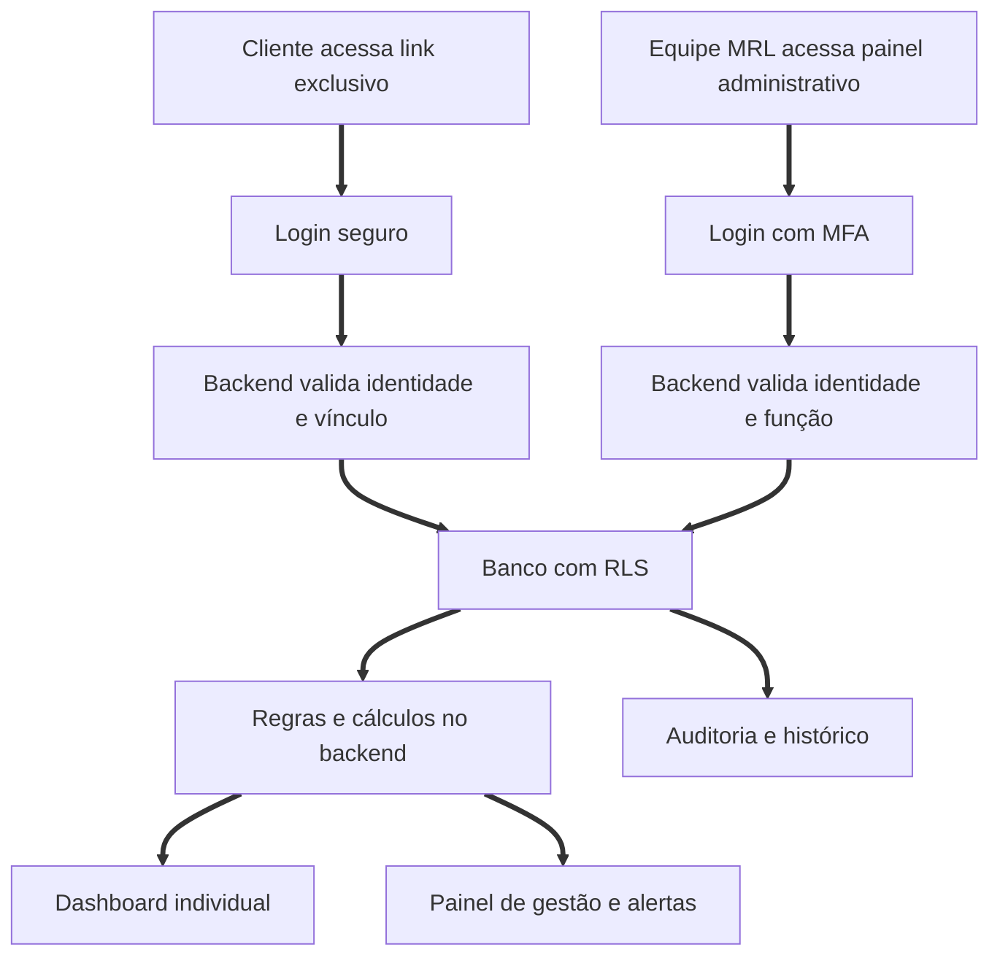
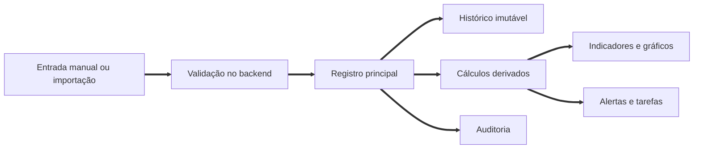

# Sistema de Gestão de Milhas MRL Travel

## Fluxo oficial, regras de negócio e protocolo de evolução

| Campo | Definição |
| :--- | :--- |
| Documento | Fonte oficial da lógica do projeto |
| Versão | 1.1.2 |
| Data inicial | 15 de julho de 2026 |
| Responsável pelo negócio | MRL Travel |
| Objetivo | Preservar a lógica funcional, técnica e de segurança durante todo o desenvolvimento |
| Regra de atualização | Toda demanda que alterar comportamento, dados, segurança ou interface deve atualizar este documento |

## 1. Objetivo do sistema

O Sistema de Gestão de Milhas MRL Travel deverá centralizar a gestão de pontos de cartões de crédito e programas de fidelidade dos clientes. Cada cliente terá acesso a um dashboard exclusivo para consultar saldos, patrimônio estimado, economia gerada, gastos mensais, pontos esperados, pontos recebidos, vencimentos e movimentações.

O sistema também terá um painel administrativo para a equipe da MRL Travel cadastrar clientes, lançar informações, acompanhar contratos, identificar vencimentos, registrar emissões e controlar todo o histórico da gestão.

## 2. Princípios obrigatórios

1. O frontend nunca será a autoridade de segurança.
2. Toda permissão será validada no backend e no banco de dados.
3. Um cliente nunca poderá consultar dados de outro cliente.
4. O identificador presente na URL não será usado como única autenticação.
5. Toda alteração administrativa relevante deverá gerar registro de auditoria.
6. Cálculos financeiros e de pontuação deverão ser executados no backend.
7. O histórico não será reescrito quando regras ou valores atuais mudarem.
8. Nenhuma senha bancária, código de segurança ou número completo de cartão será armazenado.
9. Toda nova funcionalidade deverá preservar o que já está funcionando.
10. Toda demanda deverá resultar em análise de impacto, patch controlado e validação.

## 3. Arquitetura oficial

| Camada | Tecnologia ou responsabilidade |
| :--- | :--- |
| Endereço principal | `gestao.mrltravel.com` |
| Interface | React, Vite, TypeScript, Tailwind e shadcn/ui |
| Gráficos | Recharts |
| Autenticação | Supabase Auth |
| Backend | Supabase Edge Functions, funções SQL e regras de banco |
| Banco de dados | PostgreSQL em projeto Supabase dedicado |
| Project Ref do Supabase | `bdkazlhvnowjehdgxege` |
| Project URL do Supabase | `https://bdkazlhvnowjehdgxege.supabase.co` |
| Chave pública do frontend | Publishable Key configurada por variável de ambiente |
| Segurança de linhas | Row Level Security em todas as tabelas expostas |
| Arquivos | Storage privado com links temporários |
| Hospedagem | Vercel |
| Observabilidade | Logs de erros, acesso, alterações e eventos de segurança |

### 3.1 Fluxo técnico principal



## 4. Perfis e permissões

| Perfil | Permissões principais |
| :--- | :--- |
| Super administrador | Configura o sistema, gerencia usuários administrativos e acessa todos os registros |
| Gestor MRL | Cadastra clientes, programas, cartões, gastos, movimentações, emissões e contratos |
| Operador MRL | Executa lançamentos permitidos, sem acesso a configurações críticas |
| Auditor | Consulta dados e históricos, sem alterar registros |
| Cliente | Consulta somente os próprios dados e relatórios |

### 4.1 Regra de autorização

Esconder um botão ou menu no frontend não representa segurança. Cada consulta, inclusão, alteração ou exclusão deverá ser autorizada novamente no backend.

Uma operação somente poderá continuar quando todas as condições forem verdadeiras:

1. A sessão é válida.
2. O usuário está ativo.
3. O perfil possui a permissão exigida.
4. O cliente solicitado está vinculado ao usuário ou ao operador autorizado.
5. O registro pertence ao cliente indicado.
6. A operação passou pela validação de conteúdo.

## 5. Fluxo de acesso do cliente

1. O administrador cadastra o cliente.
2. O backend cria um `public_id` aleatório e não sequencial.
3. O sistema cria o vínculo entre o cliente e o usuário autenticável.
4. O cliente recebe um convite de acesso de uso único e com prazo de validade.
5. O cliente acessa `gestao.mrltravel.com/c/{public_id}`.
6. O cliente digita o primeiro nome, utilizado apenas para localizar o usuário vinculado àquele link.
7. O backend envia um código temporário ao contato previamente cadastrado.
8. O cliente informa o código e o Supabase cria uma sessão autenticada.
9. O backend valida sessão, usuário, vínculo e status do contrato.
10. O backend retorna apenas o conjunto de dados permitido para aquele cliente.
11. O dashboard informa a data e a hora da última atualização.
12. Tentativas inválidas são registradas e limitadas.

O primeiro nome não será tratado como senha. A autenticação real será realizada pelo código temporário e pela sessão emitida após a confirmação do contato cadastrado.

### 5.1 Regras do link exclusivo

1. O `public_id` deverá possuir entropia mínima equivalente a 128 bits.
2. O identificador não poderá ser CPF, e-mail, código sequencial ou nome do cliente.
3. O identificador poderá ser rotacionado pelo administrador.
4. A URL identificará a página, mas não autorizará a leitura dos dados.
5. Convites deverão ser revogáveis, temporários e de uso único.

## 6. Fluxo administrativo

1. O profissional acessa o painel administrativo.
2. O sistema exige autenticação e segundo fator.
3. O backend carrega a função e as permissões do profissional.
4. O painel apresenta indicadores conforme a permissão.
5. O profissional seleciona ou cadastra um cliente.
6. O profissional lança saldos, gastos, pontuações, movimentações, vencimentos ou emissões.
7. O backend valida formato, propriedade, duplicidade e consistência.
8. A operação é gravada em transação de banco.
9. Os cálculos derivados são atualizados.
10. Um registro de auditoria é criado.
11. Alertas relacionados são recalculados.
12. O dashboard do cliente passa a exibir a nova informação.

## 7. Fluxo dos dados



### 7.1 Fontes de entrada do MVP

1. Lançamento manual pela equipe MRL Travel.
2. Importação de planilha padronizada.
3. Anexos comprobatórios em área privada.

### 7.2 Evoluções posteriores

1. Importação automatizada de faturas autorizadas.
2. Integrações oficiais com programas que disponibilizem API adequada.
3. Leitura assistida de comprovantes com revisão humana antes da gravação.
4. Notificações por e-mail e WhatsApp conforme consentimento e configuração.

## 8. Módulos do dashboard do cliente

| Módulo | Conteúdo |
| :--- | :--- |
| Resumo | Saldo total, patrimônio estimado, economia e emissões |
| Programas | Saldos, custo médio, valor estimado, validade e atualização |
| Evolução | Histórico mensal do saldo acumulado |
| Movimentação | Créditos, bônus, transferências, resgates e expirações |
| Cartões | Gastos, regra de acúmulo, pontos esperados e recebidos |
| Emissões | Passagens e hospedagens emitidas com pontos |
| Economia | Comparação entre referência em dinheiro e custo efetivo |
| Vencimentos | Pontos a expirar em 30, 60 e 90 dias |
| Gestão | Início do contrato, término, dias restantes e última atualização |

## 9. Módulos do painel administrativo

| Módulo | Funções |
| :--- | :--- |
| Visão geral | Indicadores de clientes, pontos, economia, pendências e contratos |
| Clientes | Cadastro, pesquisa, status, acesso e detalhamento |
| Cartões | Produtos, regras de acúmulo, últimos quatro dígitos e vigência |
| Programas | Contas de fidelidade, saldos, custos e validade |
| Gastos | Lançamentos mensais e importações |
| Movimentações | Crédito, bônus, transferência, resgate, ajuste e expiração |
| Emissões | Registro do uso de pontos e custos envolvidos |
| Vencimentos | Alertas, prioridades e tarefas |
| Contratos | Início, término, plano, status e prazo restante |
| Usuários | Perfis administrativos e vínculos de clientes |
| Auditoria | Histórico completo de ações e alterações |
| Configurações | Programas, cartões, fórmulas, valores e notificações |

## 10. Modelo de dados oficial

### 10.1 Identidade e acesso

| Tabela | Responsabilidade |
| :--- | :--- |
| `profiles` | Perfil público mínimo do usuário autenticado |
| `clients` | Cadastro principal do cliente |
| `client_users` | Vínculo entre usuários e clientes |
| `staff_roles` | Função administrativa do profissional |
| `access_invites` | Convites temporários e revogáveis |
| `login_events` | Tentativas e eventos de autenticação |

### 10.2 Cartões e gastos

| Tabela | Responsabilidade |
| :--- | :--- |
| `credit_cards` | Banco, produto, bandeira e quatro últimos dígitos |
| `card_earning_rules` | Regra de pontuação e período de vigência |
| `card_statements` | Resumo mensal da fatura e gasto elegível |
| `statement_adjustments` | Exclusões, bônus ou ajustes do período |

### 10.3 Programas e pontos

| Tabela | Responsabilidade |
| :--- | :--- |
| `loyalty_programs` | Catálogo de programas de fidelidade |
| `program_accounts` | Conta do cliente em cada programa |
| `balance_snapshots` | Fotografia do saldo em cada data |
| `point_transactions` | Movimentações de pontos |
| `expiration_lots` | Lotes de pontos e vencimentos |
| `transfers` | Transferências entre programas e bônus |

### 10.4 Emissões e economia

| Tabela | Responsabilidade |
| :--- | :--- |
| `redemptions` | Registro principal da emissão |
| `redemption_segments` | Trechos, hotéis ou componentes emitidos |
| `redemption_costs` | Pontos, taxas, dinheiro e demais custos |
| `cash_references` | Valor de referência em dinheiro e evidência |

### 10.5 Gestão e governança

| Tabela | Responsabilidade |
| :--- | :--- |
| `management_contracts` | Vigência e situação da gestão |
| `tasks` | Pendências operacionais |
| `notifications` | Alertas enviados ou programados |
| `attachments` | Metadados de arquivos privados |
| `audit_logs` | Histórico de ações administrativas |

## 11. Fórmulas oficiais

### 11.1 Saldo total

```text
Saldo total = soma do saldo atual de cada conta ativa
```

O saldo atual de cada programa será obtido pelo snapshot válido mais recente, considerando ajustes confirmados.

### 11.2 Patrimônio estimado

```text
Patrimônio estimado = soma de saldo do programa × valor do ponto do programa
```

O valor usado deverá possuir data de vigência. Alterações futuras não poderão reescrever o valor histórico exibido em relatórios fechados.

### 11.3 Pontos esperados em cartão por dólar

```text
Pontos esperados = gasto elegível em reais ÷ cotação utilizada × pontos por dólar
```

### 11.4 Pontos esperados em cartão por real

```text
Pontos esperados = gasto elegível em reais × pontos por real
```

### 11.5 Divergência de pontuação

```text
Divergência = pontos recebidos menos pontos esperados
```

Uma tolerância configurável poderá evitar alertas causados por arredondamentos do emissor.

### 11.6 Economia gerada

```text
Economia gerada = preço de referência em dinheiro menos custo efetivo da emissão
```

```text
Custo efetivo = taxas + pagamento adicional + custo atribuído aos pontos utilizados
```

Cada emissão deverá guardar a versão da fórmula, os valores utilizados e a evidência da referência em dinheiro.

### 11.7 Tempo restante de gestão

```text
Dias restantes = data final do contrato menos data atual
```

## 12. Alertas obrigatórios

1. Pontos vencendo em 30 dias.
2. Pontos vencendo em 60 dias.
3. Pontos vencendo em 90 dias.
4. Contrato próximo do encerramento.
5. Cliente sem atualização no período definido.
6. Pontos recebidos abaixo do esperado.
7. Saldo negativo ou movimentação inconsistente.
8. Importação duplicada.
9. Convite de acesso vencido ou revogado.
10. Tentativas de acesso bloqueadas.

## 13. Regras de segurança

1. Todas as tabelas expostas deverão usar RLS.
2. Toda política deverá ser testada com pelo menos dois clientes diferentes.
3. Operações administrativas críticas deverão exigir função autorizada.
4. Chaves secretas deverão existir somente no backend.
5. Funções públicas não poderão acessar dados privados.
6. CORS deverá aceitar somente origens aprovadas.
7. Arquivos deverão permanecer em buckets privados.
8. Links de arquivos deverão possuir validade curta.
9. O sistema deverá limitar requisições e tentativas de autenticação.
10. Logs não poderão registrar senhas, tokens completos ou dados financeiros desnecessários.
11. Dados sensíveis deverão ser minimizados.
12. Exclusões deverão seguir política de retenção e requisitos legais.
13. Backups deverão possuir procedimento de restauração testado.

## 14. Regras visuais

1. Fundo principal em preto, carvão ou azul profundo.
2. Dourado usado em ícones, bordas, indicadores e gráficos.
3. Poppins como fonte de leitura e dados.
4. GentleHearts restrita a assinaturas e detalhes institucionais.
5. Cards com contraste suficiente e espaçamento generoso.
6. Logotipos dos programas preservados em suas cores oficiais.
7. Interface responsiva para celular, tablet e computador.
8. Toda informação crítica deverá apresentar rótulo e não depender apenas de cor.

## 15. Protocolo obrigatório para cada nova demanda

Toda demanda apresentada deverá seguir este fluxo antes da entrega de um patch.

### Etapa 1: Entendimento

1. Identificar o problema ou ampliação solicitada.
2. Reescrever o comportamento esperado em termos verificáveis.
3. Separar o que é requisito, hipótese e informação ausente.
4. Confirmar somente dúvidas que realmente impeçam uma implementação segura.

### Etapa 2: Inspeção

1. Localizar os arquivos e módulos envolvidos.
2. Ler a implementação atual antes de sugerir alterações.
3. Identificar dependências diretas e indiretas.
4. Verificar banco, RLS, funções, rotas, componentes e tipos afetados.
5. Conferir alterações locais existentes para não sobrescrever trabalho anterior.

### Etapa 3: Análise de impacto

Para cada demanda, registrar:

| Item | Pergunta obrigatória |
| :--- | :--- |
| Escopo | Quais módulos serão alterados? |
| Dados | O esquema ou histórico será afetado? |
| Segurança | Existe mudança em autenticação ou autorização? |
| Compatibilidade | Algo que já funciona pode quebrar? |
| Migração | É necessário alterar o banco? |
| Interface | Desktop e celular serão afetados? |
| Testes | Como comprovar o comportamento esperado? |
| Reversão | Como desfazer a alteração com segurança? |

### Etapa 4: Estratégia do patch

1. Escolher a menor alteração capaz de resolver a demanda corretamente.
2. Evitar reescrever arquivos completos sem necessidade.
3. Separar refatorações não relacionadas.
4. Criar migrações progressivas e nunca editar uma migração já aplicada em produção.
5. Fazer validações no backend, mesmo quando também existirem no frontend.
6. Preservar contratos de dados ou versioná-los conscientemente.

### Etapa 5: Produção do patch

O patch deverá conter, conforme aplicável:

1. Alteração de componentes.
2. Alteração de tipos.
3. Alteração de serviços ou funções de backend.
4. Migração de banco.
5. Políticas RLS.
6. Validação de entrada.
7. Tratamento de erro e estado vazio.
8. Testes automatizados.
9. Atualização deste documento.
10. Registro de mudança.

### Etapa 6: Validação

1. Executar testes direcionados ao comportamento alterado.
2. Executar testes de regressão nas áreas relacionadas.
3. Executar lint e build.
4. Testar acesso com perfil administrativo.
5. Testar acesso com perfil de cliente.
6. Testar tentativa indevida entre dois clientes.
7. Testar estado sem dados, erro de rede e dados incompletos.
8. Conferir responsividade quando houver alteração visual.

### Etapa 7: Entrega

Toda entrega deverá informar:

1. Diagnóstico ou objetivo.
2. Arquivos alterados.
3. Resumo do patch.
4. Migrações necessárias.
5. Testes executados e resultado.
6. Riscos conhecidos.
7. Procedimento de publicação.
8. Procedimento de reversão, quando aplicável.

## 16. Formato padrão da demanda

```text
Título:

Problema ou ampliação desejada:

Comportamento atual:

Comportamento esperado:

Exemplos, imagens ou dados:

Prioridade:

Restrições conhecidas:
```

Mesmo quando a demanda chegar em texto livre, ela deverá ser internamente organizada neste formato antes da análise.

## 17. Formato padrão do patch

```text
PATCH MRL

Demanda:

Diagnóstico:

Causa principal:

Escopo afetado:

Estratégia aplicada:

Arquivos alterados:

Banco e migrações:

Segurança e permissões:

Testes executados:

Resultado:

Riscos restantes:

Publicação:

Reversão:
```

## 18. Critérios para considerar uma demanda concluída

Uma demanda somente poderá ser marcada como concluída quando:

1. O comportamento solicitado estiver implementado.
2. A causa principal estiver tratada quando se tratar de correção.
3. O backend estiver protegendo a operação.
4. Os dados de clientes diferentes continuarem isolados.
5. O build estiver concluído sem erros.
6. Os testes relevantes estiverem aprovados.
7. Estados vazios e erros estiverem tratados.
8. A alteração não quebrar funções existentes relacionadas.
9. Este documento estiver atualizado quando a lógica for modificada.
10. A entrega incluir instruções suficientes para publicação.

## 19. Estratégia de versões

O documento e o sistema usarão versão semântica:

| Alteração | Exemplo | Uso |
| :--- | :--- | :--- |
| Correção | 1.0.1 | Corrige comportamento sem ampliar a regra |
| Ampliação compatível | 1.1.0 | Adiciona módulo ou capacidade compatível |
| Mudança estrutural | 2.0.0 | Altera contrato de dados ou fluxo principal |

## 20. Registro de mudanças

| Versão | Data | Mudança |
| :--- | :--- | :--- |
| 1.0.0 | 15/07/2026 | Criação do fluxo oficial, modelo lógico, regras de segurança e protocolo de patches |
| 1.1.0 | 15/07/2026 | Definição do acesso por link, primeiro nome, código temporário, sessão segura e início da base Supabase e Vercel |

## 21. Decisões iniciais consolidadas

1. O sistema de milhas será separado do dashboard corporativo atual.
2. O projeto terá banco Supabase próprio.
3. O código visual existente poderá ser reaproveitado seletivamente.
4. O MVP começará com lançamentos manuais e importação padronizada.
5. O cliente terá acesso de leitura aos próprios dados.
6. O administrador terá autenticação em dois fatores.
7. O link exclusivo não substituirá autenticação.
8. Todos os cálculos oficiais serão executados no backend.
9. Toda nova demanda produzirá análise, patch, testes e atualização da documentação quando necessário.
10. O primeiro nome será um seletor de identidade e nunca substituirá o código temporário.
11. A aplicação será publicada pela Vercel e utilizará um projeto Supabase PostgreSQL dedicado.
